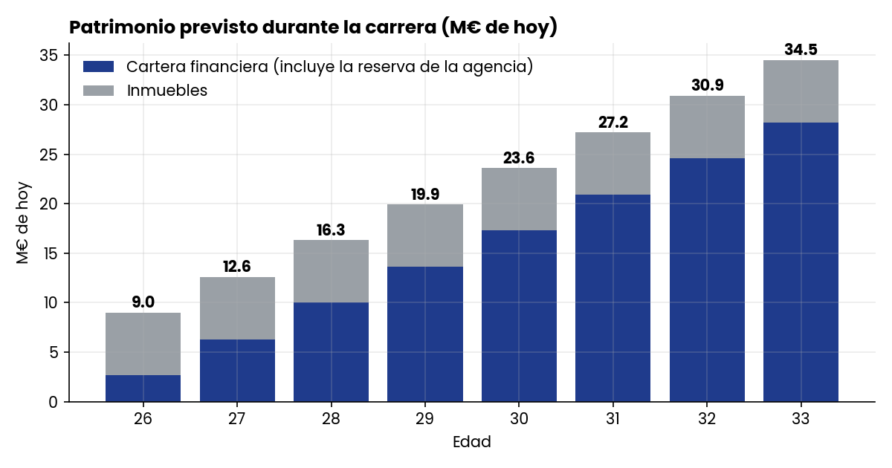
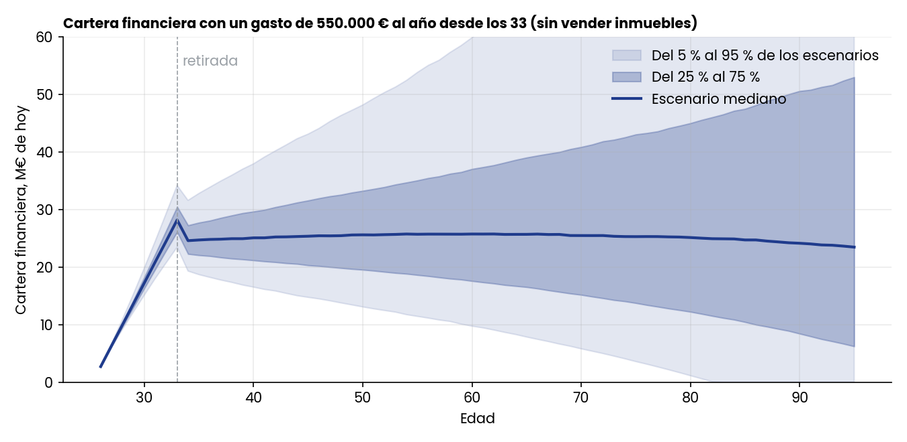
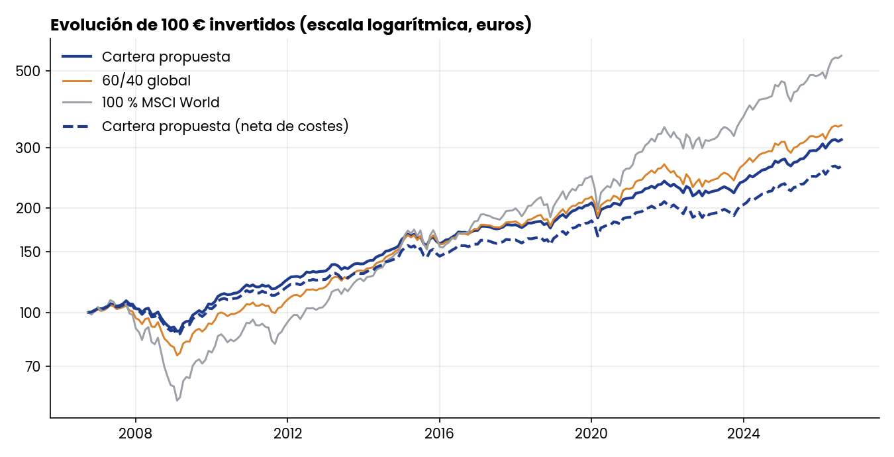
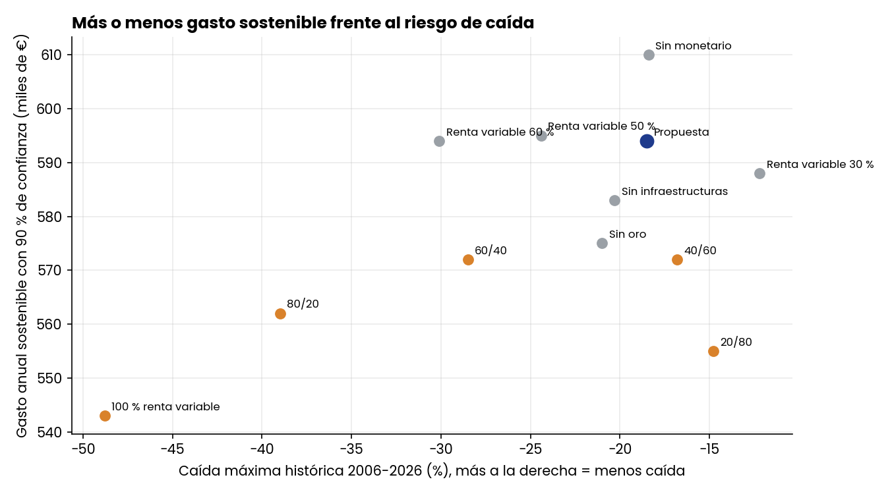
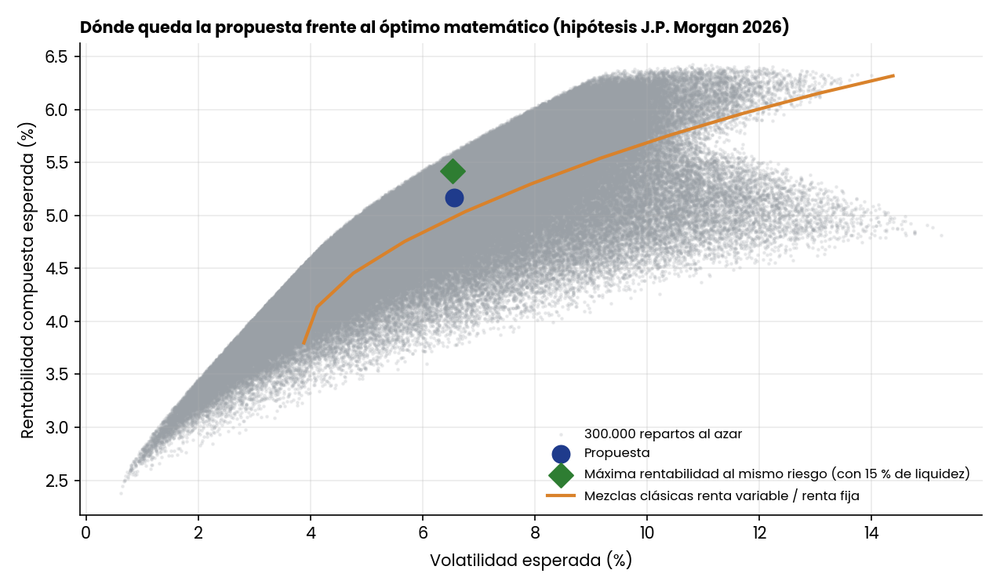

# Finect Talent 2026, Caso A "El futbolista": análisis cuantitativo

Equipo 1 UCM: Sergio Tagarro Pintado, Juan David García Reales y Rodrigo Santana Sánchez de la Nieta. Tutor: Javier García Escobar.

Este repositorio reúne todo el trabajo cuantitativo detrás de la presentación: el modelo del plan, las simulaciones, el backtest histórico y la comparación de la cartera propuesta con alternativas. El código está en español y comentado para poder leerlo, ejecutarlo y modificarlo.

## Las tres preguntas que contesta

1. **¿Cuánto puede gastar al año el futbolista sin quedarse sin dinero antes de los 95?** Simulación Monte Carlo del plan completo. Respuesta: unos 566.000 € al año (euros de hoy) con un 90 % de confianza, 550.000 € llegan a los 95 en el 92 % de los escenarios.
2. **¿Cómo se habría comportado la cartera en el pasado?** Backtest con datos reales de 2006 a 2026. Respuesta: 6,0 % anual, caída máxima del 18,5 % en 2008 frente al 28,5 % de una 60/40.
3. **¿Por qué esos porcentajes y no otros?** Comparación con 12 carteras alternativas. Respuesta: entre alternativas razonables el gasto sostenible cambia poco, pero el riesgo cambia mucho; ver más abajo.

## Cómo ejecutarlo

```
pip install -r requirements.txt
python src/ejecutar_todo.py       # todo el análisis, tarda unos minutos
python src/verificar.py           # solo comprueba que las cifras clave siguen saliendo
```

También se puede ejecutar cada script por separado (ver la tabla de abajo). Los resultados se guardan en `resultados/`.

## Qué hay en cada carpeta

| Ruta | Contenido |
|---|---|
| `src/modelo_plan.py` | El motor del plan: simula la cartera año a año de los 26 a los 95. **Empieza por aquí.** |
| `src/plan_montecarlo.py` | Probabilidades de éxito y gasto sostenible; gráficos de la portada y del abanico de escenarios |
| `src/backtest_historico.py` | Backtest 2006 a 2026 de la cartera, la 60/40 y el MSCI World |
| `src/sensibilidades.py` | Qué pasa si cambian los costes, la edad de retirada, la lesión, el mercado o los impuestos |
| `src/alternativas_cartera.py` | Compara la propuesta con 12 alternativas y con el óptimo matemático |
| `src/robustez_carteras.py` | Pruebas de robustez y de estrés para decidir entre un 30 %, un 40 % y un 50 % de renta variable |
| `src/verificar.py` | Prueba automática: comprueba que el código reproduce las cifras de la presentación |
| `datos/` | Índices mensuales en euros (backtest) y supuestos de J.P. Morgan LTCMA 2026 |
| `resultados/` | Tablas CSV y gráficos generados |
| `docs/metodologia.md` | Hipótesis y fórmulas explicadas sin jerga |
| `docs/preguntas_jurado.md` | Preguntas probables del jurado, con la cifra y el script que la respalda |

## Resultados principales

### El plan (simulación Monte Carlo de 20.000 escenarios)

| Gasto anual desde los 33 (€ de hoy) | Llega a los 95, vendiendo inmuebles si hace falta | Llega a los 95, sin vender inmuebles |
|---:|---:|---:|
| 500.000 | 97,4 % | 92,0 % |
| 550.000 | 92,3 % | 84,0 % |
| 600.000 | 83,8 % | 72,9 % |
| 700.000 | 58,9 % | 48,2 % |
| 1.000.000 | 8,3 % | 6,5 % |

Gasto sostenible según la confianza: 735.000 € al 50 %, 638.000 € al 75 %, 594.000 € al 85 %, **566.000 € al 90 %** y 527.000 € al 95 %. El escenario central, sin azar, da unos 750.000 € (710.000 € sin vender los inmuebles).




### Backtest histórico (nov-2006 a ago-2026, euros)

| | Cartera propuesta | 60/40 global | 100 % MSCI World |
|---|---:|---:|---:|
| Rentabilidad anual | 6,0 % | 6,5 % | 9,0 % |
| Volatilidad anual | 6,2 % | 8,4 % | 13,6 % |
| Caída máxima (2007-09) | -18,5 % | -28,5 % | -48,8 % |
| Caída en 2022 | -9,4 % | -14,1 % | -13,4 % |
| Peor tramo de 5 años (por año) | +2,2 % | +0,6 % | -2,9 % |



### ¿Por qué esos porcentajes y no otros?

**Lo que sí podemos decir.** Los pesos no salen de un optimizador: los elegimos con criterios de sentido común (liquidez para cubrir una lesión, poca renta variable porque sus ingresos ya son muy arriesgados, diversificadores con poco peso y productos baratos). Después los contrastamos con simulaciones: comparamos la propuesta con 12 alternativas en el plan completo y con datos históricos reales.

**Lo que NO podemos decir.** Que las simulaciones nos dieran estos porcentajes, ni que sean los óptimos. Lo que muestran es que son razonables y que alrededor de ellos el resultado es bastante estable.

| Cartera | Rentab. LTCMA | Vol. LTCMA | Gasto al 90 % | Gasto al 95 % | Gasto al 90 % si lesión a los 29 | Caída máx. histórica |
|---|---:|---:|---:|---:|---:|---:|
| **Propuesta (40 % RV)** | 5,22 % | 6,57 % | 594.000 | 558.000 | 336.000 | -18,5 % |
| Renta variable 30 % | 4,93 % | 5,41 % | 588.000 | 559.000 | 333.000 | -12,2 % |
| Renta variable 50 % | 5,49 % | 7,80 % | 595.000 | 553.000 | 336.000 | -24,4 % |
| Renta variable 60 % | 5,74 % | 9,08 % | 594.000 | 546.000 | 336.000 | -30,1 % |
| Sin oro | 5,04 % | 6,61 % | 575.000 | 541.000 | 329.000 | -21,0 % |
| Sin infraestructuras | 5,24 % | 7,21 % | 583.000 | 545.000 | 332.000 | -20,3 % |
| Sin monetario | 5,43 % | 6,85 % | 610.000 | 571.000 | 342.000 | -18,4 % |
| 60/40 | 5,54 % | 9,17 % | 572.000 | 526.000 | 328.000 | -28,5 % |
| 100 % renta variable | 6,32 % | 14,38 % | 543.000 | 479.000 | 320.000 | -48,8 % |

(Gastos en euros de hoy al año. En la propuesta con la volatilidad prudente del 7,6 % que usa la presentación, el gasto al 90 % es de 573.000 €; ver `resultados/alternativas/comparacion_carteras.csv`.)

Lo que se lee de la tabla:

* **El gasto sostenible casi no depende de la cantidad de renta variable.** Entre un 30 % y un 60 % de renta variable el gasto al 90 % se mueve solo entre 588.000 y 595.000 €. Más renta variable sube la rentabilidad media, pero también la volatilidad, y las dos cosas se compensan.
* **El riesgo sí cambia mucho.** La caída máxima histórica pasa del -12 % al -30 % en ese mismo rango. Por eso preferimos una cartera tranquila: ganamos estabilidad prácticamente sin perder gasto sostenible.
* **No hay una única cartera ganadora.** Con un 30 % de renta variable sale casi igual con menos caída; con un 50 % sale igual con más. La elección del 40 % es de preferencia por el riesgo, no una verdad matemática.
* **El monetario del 15 % tiene un coste.** Sin él el gasto sube unos 16.000 € al año, pero la cartera cae más en 2022 (-11,6 % frente a -9,4 %). Es el precio del colchón para una lesión.
* **El oro y las infraestructuras aportan.** Quitar el oro baja el gasto 19.000 € y empeora la caída de 2008 y 2022; quitar las infraestructuras lo baja 11.000 €.
* **El óptimo matemático existe y no lo usamos.** Con las hipótesis de J.P. Morgan, la combinación con más rentabilidad para el mismo riesgo daría unos 0,25 puntos más (5,4 % frente a 5,2 %), pero con un 26 % en infraestructuras y un 20 % en oro. Es una cartera muy concentrada en activos con estimaciones inciertas y poco líquidos, que no recomendaríamos a un cliente así. La propuesta queda por encima de cualquier mezcla clásica de renta variable y renta fija.




### ¿Y por qué un 40 % de renta variable y no un 30 %?

La comparación anterior no basta para decidir entre 30 % y 40 %, porque a 90 % y 95 % de confianza dan casi lo mismo. Por eso hay un segundo análisis (`src/robustez_carteras.py`) con pruebas de qué pasa cuando las cosas salen peor y cuánto patrimonio queda:

| | RV 30 % | **Propuesta (40 %)** | RV 50 % | 60/40 |
|---|---:|---:|---:|---:|
| Prob. de llegar a 95 gastando 600.000 € | 87,2 % | **88,9 %** | 89,3 % | 86,1 % |
| Gasto al 90 %, rentabilidad 1 punto menor | 498.000 | **503.000** | 505.000 | 487.000 |
| Gasto al 90 %, inflación del 3 % | 467.000 | **471.000** | 473.000 | 457.000 |
| Gasto al 90 %, llegando a los 100 años | 559.000 | **565.000** | 567.000 | 545.000 |
| Gasto central sin crisis | 712.000 | **752.000** | 789.000 | 797.000 |
| Gasto central si hay una crisis como 2008 justo al retirarse | 681.000 | **698.000** | 713.000 | 682.000 |
| Patrimonio mediano a los 95 (M€ de hoy) | 17,8 | **26,5** | 36,4 | 37,9 |
| Caída máxima histórica 2007-09 | -12,2 % | **-18,5 %** | -24,4 % | -28,5 % |

Qué se puede defender con esto:

* **El 40 % iguala o supera al 30 % en todo lo que afecta al gasto.** Gasto central (+40.000 €), gasto tras una crisis (+17.000 €), con rentabilidades peores, con más inflación o con más longevidad (+4.000 a +6.000 €), y deja más patrimonio (mediana de 26,5 M€ frente a 17,8 M€). En el 10 % de peores escenarios es parecido (2,7 M€ frente a 2,2 M€).
* **El coste de pasar del 30 % al 40 % es más oscilación**: una caída histórica del 18,5 % en lugar del 12,2 %.
* **La prueba de estrés es la más convincente.** Con una crisis como la de 2007-09 justo al retirarse, el gasto central baja un 7 %, de 752.000 a 698.000 €, y sigue por encima de los 550.000 € del plan.
* **¿Por qué parar en el 40 % y no subir al 50 %?** Porque más renta variable ya no compra seguridad: con un 50 % el gasto al 90 % es de 595.000 €, solo 1.000 € más, y la caída histórica empeora seis puntos. Con un 60/40 el gasto seguro incluso baja.
* **La composición también importa.** Una mezcla clásica 40/60 de renta variable y renta fija, con la misma renta variable y una volatilidad parecida, da 572.000 € al 90 %: 22.000 € menos que nuestra mezcla con monetario, oro e infraestructuras.

Lo que no demuestra: que 40 % sea mejor que 30 % en un sentido absoluto. El modelo supone rentabilidades independientes entre años y volatilidad constante, y las crisis reales tienen colas más gruesas, lo que favorece a las carteras con menos renta variable. Con un 30 % se duerme mejor y se gasta algo menos. El 40 % es el punto en que más rentabilidad esperada y más patrimonio todavía no cuestan seguridad en el gasto, y es una decisión de preferencia por el riesgo que hay que presentar como tal.

### Sensibilidades (gasto al 90 % de confianza, caso base 566.000 €)

| Cambio | Gasto | Diferencia |
|---|---:|---:|
| Costes 0,6 % en lugar de 0,9 % | 595.000 | +5,2 % |
| Retirada a los 35 con sueldo reducido | 611.000 | +8,0 % |
| Retirada a los 36 con sueldo reducido | 634.000 | +12,1 % |
| Lesión grave, retirada a los 29 | 325.000 | -42,5 % |
| Rentabilidad medio punto menor | 528.000 | -6,7 % |
| Rentabilidad un punto menor | 487.000 | -13,9 % |
| Inflación 3 % en lugar de 2 % | 451.000 | -20,2 % |
| Sin régimen de impatriados (renta disponible 3,55 M€) | 452.000 | -20,0 % |
| Sin agencia | 627.000 | +10,9 % |

Tablas completas en `resultados/sensibilidades/`.

## Limitaciones (importante para defenderlo bien)

* **Las hipótesis son del equipo, no datos del enunciado.** Sueldo, patrimonio, residencia en Francia y retirada a los 33 son supuestos declarados en la presentación.
* **Rentabilidades futuras:** vienen de las hipótesis a largo plazo de J.P. Morgan AM (LTCMA 2026), que son estimaciones, no garantías. El backtest histórico es mejor que esas hipótesis (6,0 % frente a 5,2 %), sobre todo por el oro (11 % anual en estos años) y una década muy buena de renta variable; por eso el plan usa la cifra prospectiva.
* **El modelo es una simplificación.** Tipos fiscales constantes, un solo tipo de ganancia, rentabilidades independientes de un año a otro, volatilidad constante y sin cambios de legislación. La volatilidad usada (7,6 %) es más prudente que la de la LTCMA (6,6 %).
* **La comparación contrato frente a cuenta de valores** (`sensibilidades.py`) sale algo mejor para la cuenta de valores porque el modelo no recoge el diferimiento al cambiar de fondo ni la protección y portabilidad del contrato. El contrato se justifica por motivos no cuantificados aquí.
* **El backtest usa índices, no los fondos concretos**, y el índice de infraestructuras no está cubierto a euros mientras que el fondo propuesto sí.
* **Pendiente de verificar con un especialista:** el crédito de IFI entre España y Francia a partir del sexto año, si la exención del 50 % de rentas pasivas del 155 B alcanza al contrato, y si el contrato luxemburgués cumple los requisitos para seguir difiriendo el impuesto si volviera a España.

## Cómo aprender con este código

Orden de lectura recomendado:

1. `src/modelo_plan.py`: la función `simular` es el corazón. Léela de arriba abajo con el docstring a mano.
2. `src/plan_montecarlo.py`: ve cómo se usa el modelo para sacar las tablas.
3. `src/backtest_historico.py`: otra forma de contrastar, con datos reales.
4. `src/alternativas_cartera.py` y `src/robustez_carteras.py`: cómo se comparan carteras con los tres métodos y con pruebas de estrés.

Ejercicios para entenderlo cambiando algo:

* En `modelo_plan.py` cambia `COSTE_TOTAL` a 0,006 y mira cuánto sube el gasto sostenible.
* Prueba `gasto_sostenible(0.90, vender_inmuebles=True, edad_retirada=31)` desde una consola de Python.
* Añade una cartera nueva al diccionario `CARTERAS` de `alternativas_cartera.py` y compárala.
* Cambia la semilla (`semilla=7`) por otra y comprueba que los resultados apenas se mueven; eso indica que 20.000 escenarios son suficientes.

## Fuentes

* J.P. Morgan Asset Management, Long-Term Capital Market Assumptions 2026 (matriz en euros).
* Niveles mensuales de índices de rentabilidad total en euros obtenidos de [Curvo](https://curvo.eu/backtest).
* Guiso, Jappelli y Terlizzese (1996), Bodie, Merton y Samuelson (1992), sobre riesgo de ingresos laborales y cartera óptima.

Trabajo académico para un concurso universitario. No es una recomendación de inversión.
